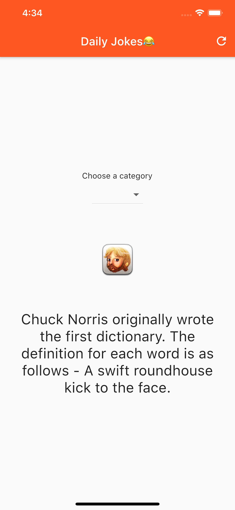

# flutter_command_example

A Chuck Noris jokes app built with Flutter Command

## 💻 Requirements

* Any Operating System (i.e MacOS X, Linux, Windows)
* Any IDE with Flutter SDK installed (ie. IntelliJ, Android Studio, VSCode etc)
* Flutter Command

## 📸 Screenshots

## 🔌 Plugins

| Name | Usage |
|:------:|:-------:|
|[**flutter_command**](https://pub.dev/packages/flutter_command)| State Management|
|[**DIO**](https://pub.dev/packages/dio)| Network calls|

## 🤓 Author

**Ajiboye Temitope Oluwatayomi** 
